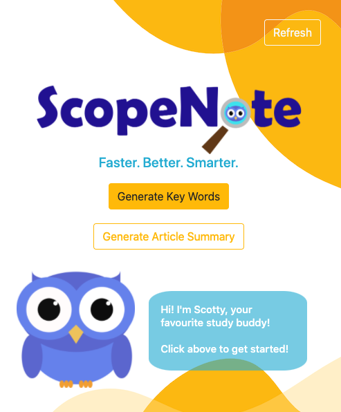
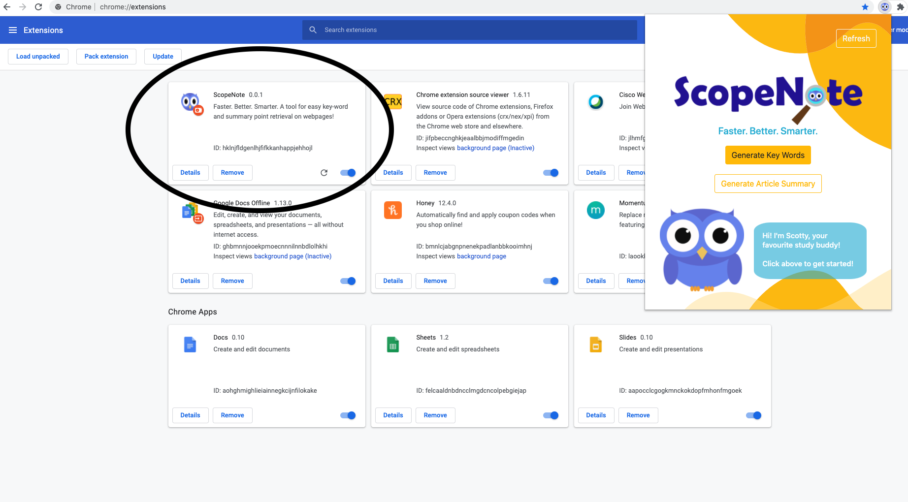
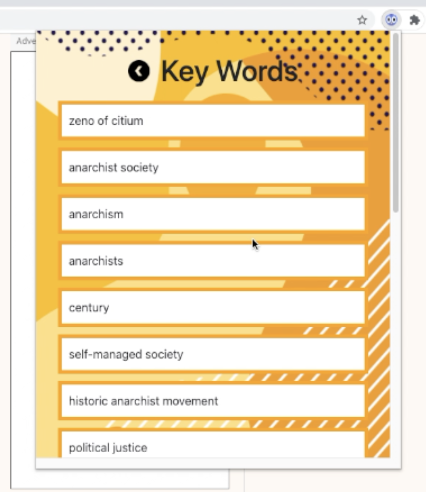
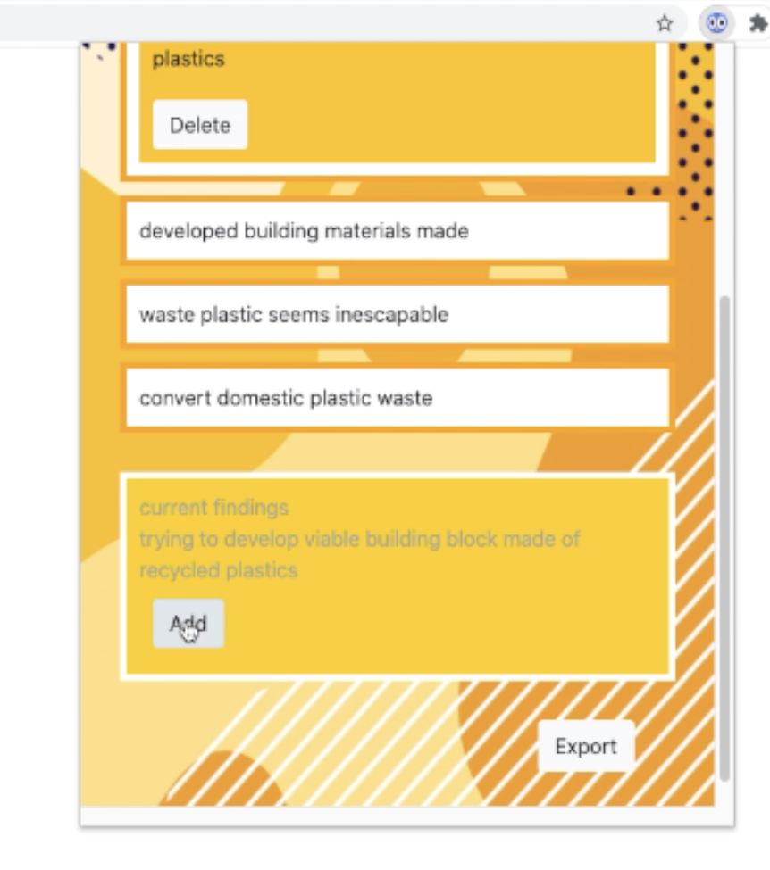

# ScopeNote
Faster. Better. Smarter.
(HackThe6ix 2020 Submission)

# preview 

# our goal 

Back to remote learning, with teachers being less accessible on an individual scale, they will likely take up only a minute portion of the educational guidance students receive. Their feedback will likely be replaced by students having to find their own resources online and self-study, and our goal is to make these tasks as meaningful as possible. By breaking down complex articles and automatically documenting key words and phrases, ScopeNote aims to reduce the time needed for monotonous tasks like sifting through irrelevant articles and making study notes in favour of reading useful pages and honing in on the most relevant points.

# functionality

ScopeNote is a Chrome extension that provides two main features that supplement a student’s learning. The first is a keyword breakdown of a given article in the form of a PDF file or a website. This component analyzes the text within an article and identifies around fifteen of the most prevalent, critical keywords to a piece. In practice, this facilitates a student’s understanding of a paper by reducing the need to consistently search up most of the specific keywords in favour of having the important ones displayed on screen and only one click away.

Secondly, ScopeNote pulls some of the most important sentences from the piece that is meant to act as a summary for students to use both to ensure the content they are looking through is relevant and as a review section in their notes. While we noticed that this function was not entirely perfect, it did a fair job of capturing the tone and the content of the piece, which are also both relevant in determining how useful a piece may be for a research project or as a study resource. Again, this helps reduce the amount of time a student spends on low-effort tasks such as skimming through sources in favour of active studying or analysis. In both of the aforementioned features, students are also able to add their own commentary to supplement the software.
The functionality of ScopeNote is conducive to more active engagement with text. In particular, it opens the door for things such as flashcards, where students can take the keywords and definitions that are generated for them, which in turn says time in a tedious process of production. This helps alleviate some of the strains of monotonous, low-effort work while also improving upon more active engagement.

# creation process

The Chrome extension is coded in Python and React for the back-end and front-end, respectively. Specifically, we used the diffbot API to pull text from a website and the PyMuPDF library to read text from a .PDF file. Once the text was pulled out, we used the Azure Text Analytics API to pull key phrases that were most important to the piece. Following this, we ran a basic algorithm to determine which keywords or phrases were most prevalent in the text, and linked it to a WordsAPI to provide students with a definition. Phrases with no definition were then appended to the default Wikipedia URL so that students would be forwarded directly to the Wikipedia page on the topic. 

To process text and identify keywords, we explored other possibilities such as the RAKE algorithm and TF-IDF. While neither was as good as Azure’s API, we realized that by modifying the RAKE algorithm to include longer phrases and by using a database of the most common English words as stopwords, we could generate decently appropriate summary sentences for an article. This was leveraged in forming this functionality.

These components were then attached to the React front-end with axios, which performed HTTP requests between React and Flask. More specifically, the URL is sent from tthe front end to the backend, where the text is pulled and processed into JSON objects, which are then sent back to the front end. In React, an emphasis was made on state changes and mapping to update the information in the application, using React lifecycle functionalities to do so. The actual user interface and functionality of the Chrome extension was made in React, where CRUD actions were used so that users can edit and add notes, definitions, and so on to the automated ones.

# azure

Specifically in terms of the usage of Microsoft Azure, we leveraged Azure’s Text Analytics API to pull keywords from a piece of text. These keywords, which were ordered as they were presented in text, were then compiled into a list of tuples containing each key word/phrase and the quantity of appearances. This was compiled alongside a list of words specifically from key phrases and how many times they showed up. Our mentality was that the most important keywords for a student to know would be the ones that showed up most frequently; thus, we used these compiled lists to determine which key phrases were most important to define.

# what's next

Moving forward, we hope ScopeNote can be a tool we use in a crunch if we need to synthesize a document or information from a website. As first year students, we’re venturing into a new level of challenge in university, and thus may leverage this program in a pinch. Aside from our personal use, there is a lot of potential for growth with ScopeNote. The most immediate steps that can be taken are to develop a platform for PDFs to be uploadable through the extension itself, as opposed to having them downloaded and opened on a browser. The development of a local database, where students can store past data would also be helpful. In the future, there may also be more work done in terms of machine learning or text-processing algorithms, which in turn opens up a wide range of possibilities. For example, we could explore using ML to recognize graphical representations of data such as bar, pie, and line graphs, and convert them into meaningful, text-based data for students in their notes. Hopefully with improved algorithms, we can also improve upon the keyword and summary sentence selections to better represent the articles from which they’re pulled. With these additions, we believe ScopeNote could feasibly go from a proof-of-concept idea to genuinely applicable, if we chose to continue development in the future.

# to run 

Currently, ScopeNote is limited to the local server. 
To run, one requires the source code & flask installed.

To run backend: 
- set directory to flask
- run command "env FLASK_APP=hello.py flask run"

To try extension:
- go to chrome://extensions/
- select "Load Unpacked" at the top left
- upload the extension/build folder